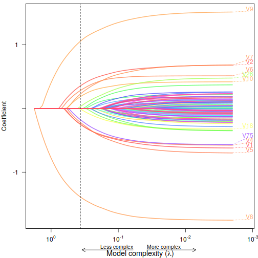

# Produce pretty plots from glmnet results

## Introduction

`glmnetPlotR` provides a couple R functions to produce prettier plots from `glmnet` and `cv.glmnet` (from the [`glmnet` package](https://cran.r-project.org/web/packages/glmnet/index.html)) results.

## Installation


```r
devtools::install_github("sherrillmix/glmnetPlotR")
```

## Examples

### Plotting cross-validated model performance
Using an example from \code{cv.glmnet}:

```r
#example from cv.glmet
library(glmnetPlotR)
set.seed(1010)
n=1000;p=100
nzc=trunc(p/10)
x=matrix(rnorm(n*p),n,p)
beta=rnorm(nzc)
fx= x[,seq(nzc)] %*% beta
eps=rnorm(n)*5
y=drop(fx+eps)
px=exp(fx)
px=px/(1+px)
ly=rbinom(n=length(px),prob=px,size=1)
set.seed(1011)
cvob1=glmnet::cv.glmnet(x,y)
plotGlmnet(cvob1)
```

 


### Tracking coefficients 

```r
plotBetas(cvob1$glmnet.fit,cvob1$lambda.1se)
```

 

------
Authors: Scott Sherrill-Mix

